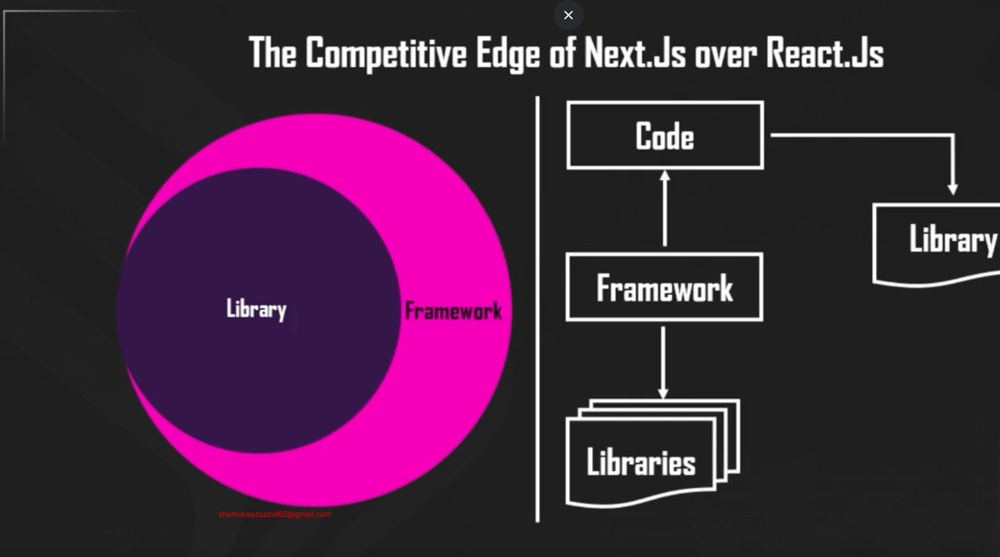
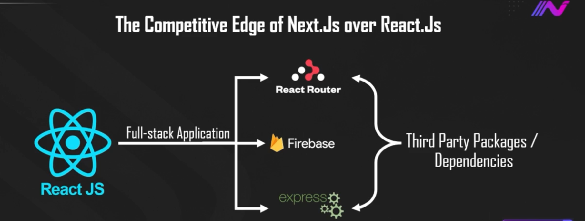
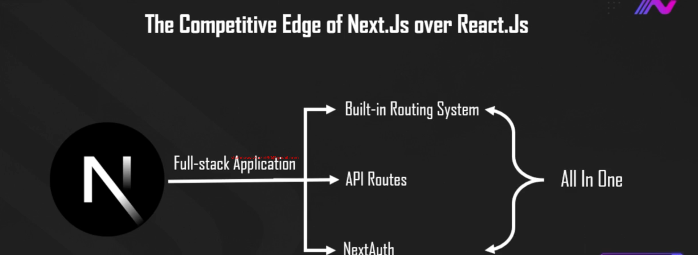
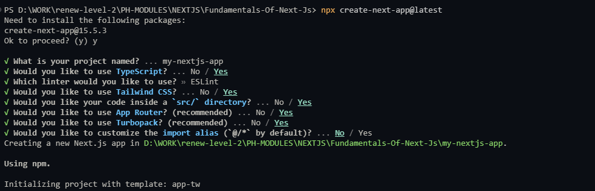
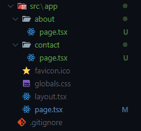
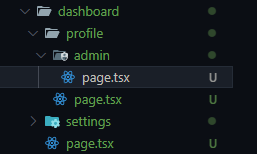

## Fundamental Of Next.js 

Welcome to Next.js! 


We’re kicking off our journey with Fundamentals of Next.js — the first step toward mastering one of the most powerful React frameworks in today’s web development world.

In this module, you’ll discover why Next.js is a game-changer compared to plain React, learn how pre-rendering works, and get hands-on by building your very first Next.js app. From routing (basic, nested, dynamic, and even catch-all!) to understanding React server components, you’ll explore the core concepts that make Next.js stand out.


By the end, you’ll also be comfortable with navigation, group routing with layouts, and styling with built-in CSS modules. This module sets the foundation you’ll need to unlock all the advanced features coming up later in our Next.js journey.


Get ready to dive in — your Next.js adventure starts here! 

## 51-1 Let's start our journey with Next.js

- The React Framework For The Web (used by some of the worlds largest companies)
- This is React With super Power 

#### The Super Powers are 
- Built In Optimization (image and font optimization will be done by default)
- Pre-rendering (SSR +SSG) -(html file created in build time)
- Next Level Data Fetching 
- Powerful Routing and Layouts 
- React Server Component (server side render and server side run)
- Server Actions 
- Route Handlers 

## 51-2 Why Next.js? The competitive edge of Next.js over React.js
- React is a js library for web and native user interfaces 
- Next.js is the react framework for the web



### head to head comparison of React vs Next.js 





- Moreover Next.js is Blazing fast because of pre-rendering 

#### What is rendering?
- Rendering is a webpage is the process of turning HTML, CSS and Javascript code into an interactive page that website visitors expect to see. 

##### Rendering is of Two Type 
- `Pre Rendering` (Next.js)
- `Client Side Rendering` (React)

#### `Pre Rendering Performance Optimization is done in two ways`
- `Static Site generation (SSG)`
- `Server Side Rendering (SSR)`

## 51-3 Clear concept of pre-rendering and client-side rendering

### Client Side Rendering 
- Client-Side Rendering (CSR) is a way of building web applications where most of the page’s content is rendered directly in the browser using JavaScript, rather than being fully generated on the server.

### Pre-Rendering 
- Pre-rendering is a technique used in modern web development where the HTML for a page is generated in advance in build time and stored the html in hosting server (before a user requests it) rather than being built on the fly in the browser (CSR) or on every request from the server (SSR).

-  This makes the content immediately available when someone visits the page, improving performance and SEO.

## 51-4 Create my first Next.js app

[Next.js](https://nextjs.org/)

#### Install Next.js 

```
npx create-next-app@latest
```



- src -> app -> app router/app Directory (routing related works will be done here)

[Next.js Documentation](https://nextjs.org/docs/app/getting-started/installation)

## 51-5 Basic routing concept and nested routing
- each and every folder under the app folder will be a route. like about, contact 



- nested routing 

