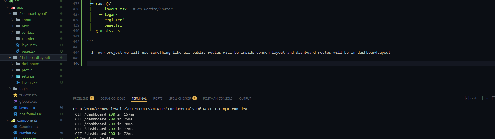
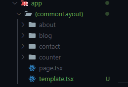
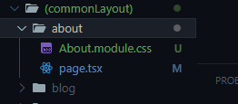

## Fundamental Of Next.js

Welcome to Next.js!

We’re kicking off our journey with Fundamentals of Next.js — the first step toward mastering one of the most powerful React frameworks in today’s web development world.

In this module, you’ll discover why Next.js is a game-changer compared to plain React, learn how pre-rendering works, and get hands-on by building your very first Next.js app. From routing (basic, nested, dynamic, and even catch-all!) to understanding React server components, you’ll explore the core concepts that make Next.js stand out.

By the end, you’ll also be comfortable with navigation, group routing with layouts, and styling with built-in CSS modules. This module sets the foundation you’ll need to unlock all the advanced features coming up later in our Next.js journey.

Get ready to dive in — your Next.js adventure starts here!

## 51-1 Let's start our journey with Next.js

- The React Framework For The Web (used by some of the worlds largest companies)
- This is React With super Power

#### The Super Powers are

- Built In Optimization (image and font optimization will be done by default)
- Pre-rendering (SSR +SSG) -(html file created in build time)
- Next Level Data Fetching
- Powerful Routing and Layouts
- React Server Component (server side render and server side run)
- Server Actions
- Route Handlers

## 51-2 Why Next.js? The competitive edge of Next.js over React.js

- React is a js library for web and native user interfaces
- Next.js is the react framework for the web


### head to head comparison of React vs Next.js


- Moreover Next.js is Blazing fast because of pre-rendering

#### What is rendering?

- Rendering is a webpage is the process of turning HTML, CSS and Javascript code into an interactive page that website visitors expect to see.

##### Rendering is of Two Type

- `Pre Rendering` (Next.js)
- `Client Side Rendering` (React)

#### `Pre Rendering Performance Optimization is done in two ways`

- `Static Site generation (SSG)`
- `Server Side Rendering (SSR)`

## 51-3 Clear concept of pre-rendering and client-side rendering

### Client Side Rendering

- Client-Side Rendering (CSR) is a way of building web applications where most of the page’s content is rendered directly in the browser using JavaScript, rather than being fully generated on the server.

### Pre-Rendering

- Pre-rendering is a technique used in modern web development where the HTML for a page is generated in advance in build time and stored the html in hosting server (before a user requests it) rather than being built on the fly in the browser (CSR) or on every request from the server (SSR).

- This makes the content immediately available when someone visits the page, improving performance and SEO.

## 51-4 Create my first Next.js app

[Next.js](https://nextjs.org/)

#### Install Next.js

```
npx create-next-app@latest
```


- src -> app -> app router/app Directory (routing related works will be done here)

[Next.js Documentation](https://nextjs.org/docs/app/getting-started/installation)

## 51-5 Basic routing concept and nested routing

- each and every folder under the app folder will be a route. like about, contact


- nested routing


## 51-6 Exploring dynamic routes and catch-all routes

- whatever component we make in next.js by default becomes server component in next.js

- grabbing dynamic route


```tsx
/* eslint-disable @typescript-eslint/no-explicit-any */
import React from "react";

const DynamicBlogPage = async ({ params }: any) => {
  // as its a server component by default we can use async

  console.log(await params);
  return (
    <div>
      <h1>Dynamic Blog Page Blog Id : 1 </h1>
    </div>
  );
};

export default DynamicBlogPage;
```


```tsx
import React from "react";

const DynamicBlogPage = async ({
  params,
}: {
  params: Promise<{ blogId: string }>;
}) => {
  // as its a server component by default we can use async
  // as this is a server component we are getting the params as promise

  const { blogId } = await params;

  console.log(blogId);
  return (
    <div>
      <h1>Dynamic Blog Page Blog Id : {blogId} </h1>
    </div>
  );
};

export default DynamicBlogPage;
```

```
http://localhost:3000/blog/1
```

- lets handle more dynamic route like

```
http://localhost:3000/blog/1/bai/habi/jani
```

- for dealing this kind of nested dynamic routes we need to use catch all routes

- blog -> `[...slug]`

```tsx
const CatchAllRoutes = async ({
  params,
}: {
  params: Promise<{ slug: string[] }>;
}) => {
  console.log(await params);
  return (
    <div>
      <h1>Catch All Routes </h1>
    </div>
  );
};

export default CatchAllRoutes;
```

- we will get the things in array of object

```
{ slug: [ '1', 'bai', 'habi', 'jani' ] }
```

## 51-7 Let's dive deep into React server components

- The component that directly renders in server side and runs in server side is called server component


- converting server component to client component
- app -> counter -> page.tsx

```tsx
"use client";
import React, { useState } from "react";

export default function Counter() {
  const [count, setCount] = useState(0);

  return (
    <div className="flex flex-col items-center gap-4 p-6">
      <h1 className="text-2xl font-bold">Counter: {count}</h1>
      <div className="flex gap-2">
        <button
          onClick={() => setCount(count + 1)}
          className="px-4 py-2 bg-green-500 text-white rounded-lg shadow"
        >
          +
        </button>
        <button
          onClick={() => setCount((prev) => Math.max(prev - 1, 0))}
          className="px-4 py-2 bg-red-500 text-white rounded-lg shadow"
        >
          -
        </button>
        <button
          onClick={() => setCount(0)}
          className="px-4 py-2 bg-gray-500 text-white rounded-lg shadow"
        >
          Reset
        </button>
      </div>
    </div>
  );
}
```

- this is not a best practice we can not enjoy server component facilities here. what to dow now?


- we will just make the client component where these is interactivity required.
- best practice
- src -> components -> Counter.tsx

```tsx
"use client";
import React, { useState } from "react";

export default function Counter() {
  const [count, setCount] = useState(0);

  return (
    <div className="flex flex-col items-center gap-4 p-6">
      <h1 className="text-2xl font-bold">Counter: {count}</h1>
      <div className="flex gap-2">
        <button
          onClick={() => setCount(count + 1)}
          className="px-4 py-2 bg-green-500 text-white rounded-lg shadow"
        >
          +
        </button>
        <button
          onClick={() => setCount((prev) => Math.max(prev - 1, 0))}
          className="px-4 py-2 bg-red-500 text-white rounded-lg shadow"
        >
          -
        </button>
        <button
          onClick={() => setCount(0)}
          className="px-4 py-2 bg-gray-500 text-white rounded-lg shadow"
        >
          Reset
        </button>
      </div>
    </div>
  );
}
```

- src -> app -> counter -> page.tsx

```tsx
import Counter from "@/components/Counter";
import React from "react";

const CounterPage = () => {
  return (
    <div>
      <Counter />
    </div>
  );
};

export default CounterPage;
```

## 51-8 Link and Programmatic Navigation

- for navigation we have `Link` that uses a href under the hood and extends and skips reloading the page.
- src -> components -> Navbar.tsx

```tsx
import Link from "next/link";
import React from "react";

export default function Navbar() {
  return (
    <nav className="w-full bg-gray-900 text-white px-6 py-3 flex items-center justify-between">
      {/* Logo / Brand */}
      <div className="text-xl font-bold">
        <Link href="/">NextJs</Link>
      </div>

      {/* Links */}
      <div className="flex space-x-6">
        <Link href="/about" className="hover:text-gray-300">
          About
        </Link>
        <Link href="/contact" className="hover:text-gray-300">
          Contact
        </Link>
        <Link href="/login" className="hover:text-gray-300">
          Login
        </Link>
      </div>
    </nav>
  );
}
```

- to make the navbar and footer available for all devices we will have to use the src ->app -> layout.tsx

```tsx
import type { Metadata } from "next";
import { Geist, Geist_Mono } from "next/font/google";
import "./globals.css";
import Navbar from "@/components/Navbar";

const geistSans = Geist({
  variable: "--font-geist-sans",
  subsets: ["latin"],
});

const geistMono = Geist_Mono({
  variable: "--font-geist-mono",
  subsets: ["latin"],
});

export const metadata: Metadata = {
  title: "Create Next App",
  description: "Generated by create next app",
};

export default function RootLayout({
  children,
}: Readonly<{
  children: React.ReactNode;
}>) {
  return (
    <html lang="en">
      <body
        className={`${geistSans.variable} ${geistMono.variable} antialiased`}
      >
        <Navbar />
        <main className="min-h-dvh">{children}</main>

        <footer className="text-center text-4xl my-5">This is Footer</footer>
      </body>
    </html>
  );
}
```

- app -> dashboard -> page.tsx
- we can stop prefetch bu using `prefetch={false}`

```tsx
import Link from "next/link";

const HomePage = () => {
  return (
    <div>
      <h1 className="text-4xl">Next.js Hello!</h1>
      <Link prefetch={false} href="/dashboard">
        <button className="border rounded-md hover:space-x-1.5">
          Dashboard
        </button>
      </Link>
    </div>
  );
};

export default HomePage;
```

- now lets see how we can do navigation programmatically. we have to use `useRouter` hook from `next/navigation`

```tsx
"use client";
import { useRouter } from "next/navigation";

const HomePage = () => {
  const router = useRouter();
  const handleNavigation = () => {
    router.push("/dashboard");
  };
  return (
    <div>
      <h1 className="text-4xl">Next.js Hello!</h1>

      <button
        onClick={handleNavigation}
        className="border rounded-md hover:space-x-1.5"
      >
        Dashboard
      </button>
    </div>
  );
};

export default HomePage;
```

- this will not prefetch and will take me to the desired route

## 51-9 Explore group routing with different layouts.

- In this lesson we explore how **Route Groups** in Next.js App Router allow us to organize routes and apply different layouts.  
  Sometimes we want certain routes (like `about`, `contact`) to have a **header and footer**, while other routes (like `login`, `register`) should not include them.  
  This can be done easily with **conditional layouts using Route Groups**.

---

### What are Route Groups?

- Route Groups let us **organize routes without affecting the URL path**.
- We create a folder wrapped in parentheses `( )` inside the `app` directory.
- Useful for applying **different layouts** to different parts of the app.

---

### Example Folder Structure

```bash
app/
 ├─ (main)/
 │   ├─ layout.tsx   # Has Header + Footer
 │   ├─ about/
 │   ├─ contact/
 │   └─ page.tsx
 ├─ (auth)/
 │   ├─ layout.tsx   # No Header/Footer
 │   ├─ login/
 │   ├─ register/
 │   └─ page.tsx
 └─ globals.css

```

- In our project we will use something like all public routes will be inside common layout and dashboard routes will be in dashboardLayout

- app directory page i mean home page is taken tyo the common layout page so that it gets the common layout. how the app works now? it will come to app directory and will see there is no page.tsx. as not available it will search in (commonLayout) or (dashboardLayout) as these do not create routes



- (commonLayout) -> layout.tsx

```tsx
import Navbar from "@/components/Navbar";

const CommonLayout = ({ children }: { children: React.ReactNode }) => {
  return (
    <div className="">
      <Navbar />
      {children}
    </div>
  );
};

export default CommonLayout;
```

- the thing is common layout group routes will get the layout and ultimately pass through the main layout as well.

- (dashboardLayout) -> layout.tsx

```tsx
import Sidebar from "@/components/Sidebar";

const DashboardLayout = ({ children }: { children: React.ReactNode }) => {
  return (
    <div className="flex">
      <Sidebar />
      {children}
    </div>
  );
};

export default DashboardLayout;
```

- accordingly these dashboard layout grouped routes will get the dashboard layout and common layout grouped layout will get the common layout . and ultimately will pass through the main layout and show.

- if we want to modify the not-found route we have to create `not-found.tsx` inside app folder

## 51-10 Explore built-in CSS module support. Module summary.

- suppose we want to navigate and want to reset the sate we have to do it manually because re-render do not happens. To do this we have a tech like layout named `template`
- we just have to replace the layout with the template. will look same as layout file.



#### Lets see the css module support

- CSS Modules in Next.js are a way of writing CSS so that the styles are scoped locally to the component that imports them.
  Each class name and animation name is automatically transformed into a unique identifier at build time.

➡️ This means styles do not leak outside the component and cannot conflict with other styles in your project.



```css
.text_style {
  color: red;
  font-size: 30px;
}
```

```tsx
import styles from "./About.module.css";

const AboutPage = () => {
  return <h1 className={styles.text_style}>About Page</h1>;
};

export default AboutPage;
```
- CSS Modules = Local Scoped CSS, Prevents conflicts across the app. Next.js automatically supports it (no config needed).